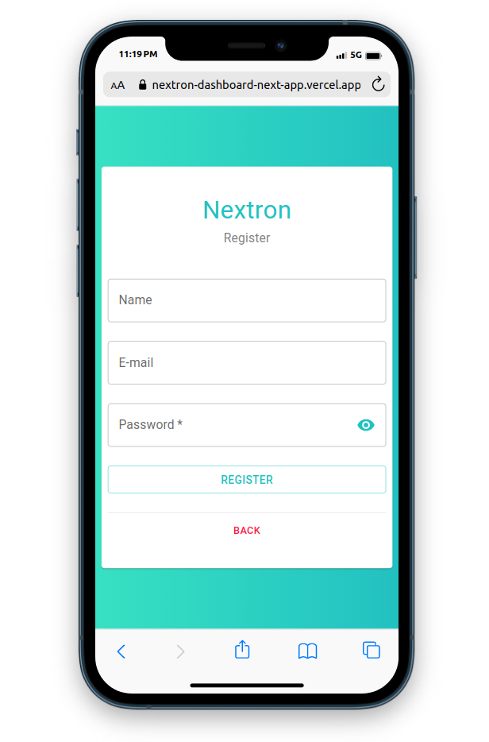
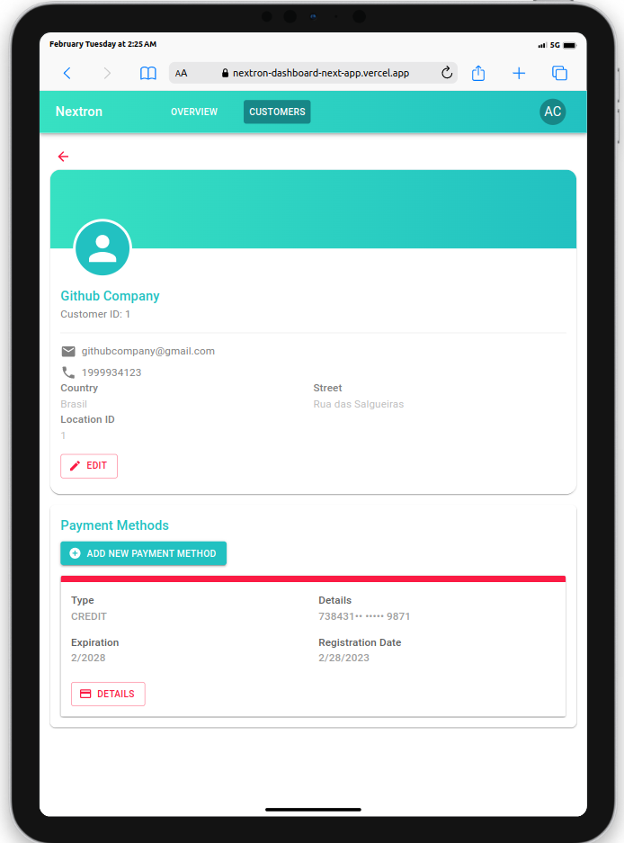
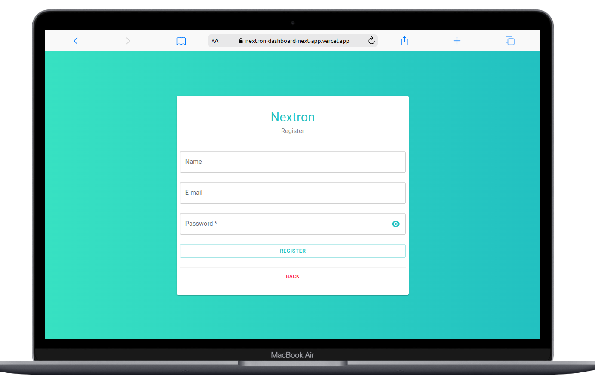

   <svg class="MuiSvgIcon-root MuiSvgIcon-fontSizeMedium css-95w34a" focusable="false" aria-hidden="true" viewBox="0 0 34 34" style="font-size:6rem" width="34" height="34" fill="none"><path d="M21.7392 0.542855C20.2638 0.181563 18.6856 0 17.0009 0C13.495 0 10.4573 0.761097 7.886 2.28146C5.31467 3.80365 3.35692 5.85403 2.01451 8.43443C0.6721 11.0148 0 13.8703 0 17.0009C0 20.1333 0.670326 22.987 2.01451 25.5674C2.84443 27.1629 3.91019 28.5567 5.21181 29.747C2.79122 15.3192 8.82054 3.47354 21.7392 0.542855Z" fill="#24B499"></path><path d="M23.7218 15.8088L20.0138 15.508C19.7194 15.4842 19.597 15.1064 19.8169 14.9028L29.9692 5.53124C28.8715 4.26397 27.5646 3.17826 26.0466 2.27961C25.2185 1.78994 24.3425 1.37913 23.4221 1.04718L10.9645 16.2912C10.7872 16.5076 10.9219 16.8395 11.195 16.8615L16.0469 17.2558C16.3164 17.2778 16.4512 17.6043 16.2809 17.8207L6.24036 30.6035C6.58616 30.8676 6.94437 31.1225 7.31677 31.3627L23.9186 16.4177C24.1403 16.216 24.018 15.8327 23.7218 15.8088Z" fill="#24B499"></path><path d="M31.9518 8.43261C31.8897 8.3134 31.8241 8.19786 31.7585 8.08049C32.5068 21.5528 22.3456 30.2275 8.20514 31.8983C10.7073 33.2976 13.6386 34 17.0008 34C20.4588 34 23.4753 33.2389 26.0466 31.7186C28.6179 30.1964 30.5863 28.146 31.9518 25.5656C33.3172 22.9852 33.9999 20.1315 33.9999 16.9991C33.9999 13.8685 33.3172 11.013 31.9518 8.43261Z" fill="#24B499"></path></svg>

# NEXTRON Energia | Frontend Challenge - Dashboard

 

# Enviroments

[Deploy link](https://nextron-dashboard-next-app.vercel.app)

# Screenshots

---

# Feature implemented 🚀

- create an account;
- login;
- logout;
- authentication;
- overview dashboard with all payments;
- list of all customers;
- create new customers;
- edit customers;
- add payment method for an customer;
- view all of a customer's details, including their payment methods;
- view details abount payment method;
- view user data (profile)

# 🛠 Technologies used

- Next with Server Side Rendering;
- Jest and Testing Library for tests;
- Vercel and Hostinger to deploy;
- React Hooks and Context API;
- Material-UI as UI library;
- React Hook Form and Zod to manage forms;
- Typescript <3;
- GoLang with Gin in backend;
